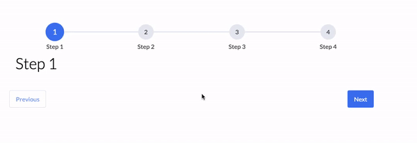

# Welcome to react-step-progress 👋


> Multi step and dynamic progress indicator for react. Built using typescript, hooks and lots-o'-☕ and lots-o'-❤️ .
> Uses CSS modules so you don't have to worry about your CSS class names clashing with ours



## Install

```
npm install --save react-step-progress
```

## Usage

> **NOTE:** I'm working towards an implementation where you don't have to import the stylesheet explicitly. I feel like that's not an ideal solution. Feel free to help me out 😁

```javascript
// import the progress bar
import StepProgressBar from 'react-step-progress';
// import the stylesheet
import 'react-step-progress/dist/index.css';

// setup the step content
const step1Content = <h1>Step 1 Content</h1>;
const step2Content = <h1>Step 2 Content</h1>;
const step3Content = <h1>Step 3 Content</h1>;

// setup step validators, will be called before proceeding to the next step
function step2Validator() {
  // return a boolean
}

function step3Validator() {
  // return a boolean
}

// render the progress bar
<StepProgressBar
  startingStep={0}
  steps={[
    {
      label: 'Step 1',
      name: 'step 1',
      content: step1Content
    },
    {
      label: 'Step 2',
      name: 'step 2',
      content: step2Content,
      validator: step2Validator
    },
    {
      label: 'Step 3',
      name: 'step 3',
      content: step3Content,
      validator: step3Validator
    }
  ]}
/>
```

## Available Props

* startingStep (`number`) - the index of the step at which to start
* steps (`ProgressStep[]`) - array of steps with each step containing a label, name and content
* wrapperClass (`string`) - CSS class name for progress wrapper element
* progressClass (`string`) - CSS class name for progress bar element
* stepClass (`string`) - CSS class name for step indicator
* contentClass (`string`) - CSS class name for step content element
* buttonWrapperClass (`string`) - CSS class name for action buttons wrapper element
* primaryBtnClass (`string`) - CSS class name for primary themed button
* secondaryBtnClass (`string`) - CSS class name for secondary themed button

## Author

👤 **Gaurav Saini**

* Github: [@saini-g](https://github.com/saini-g)
* LinkedIn: [@saini-g](https://linkedin.com/in/saini-g)

## Show your support

Give a ⭐️ if this project helped you!

## CONTRIBUTING & CODE OF CONDUCT

See [CODE_OF_CONDUCT.md](CODE_OF_CONDUCT.md)
